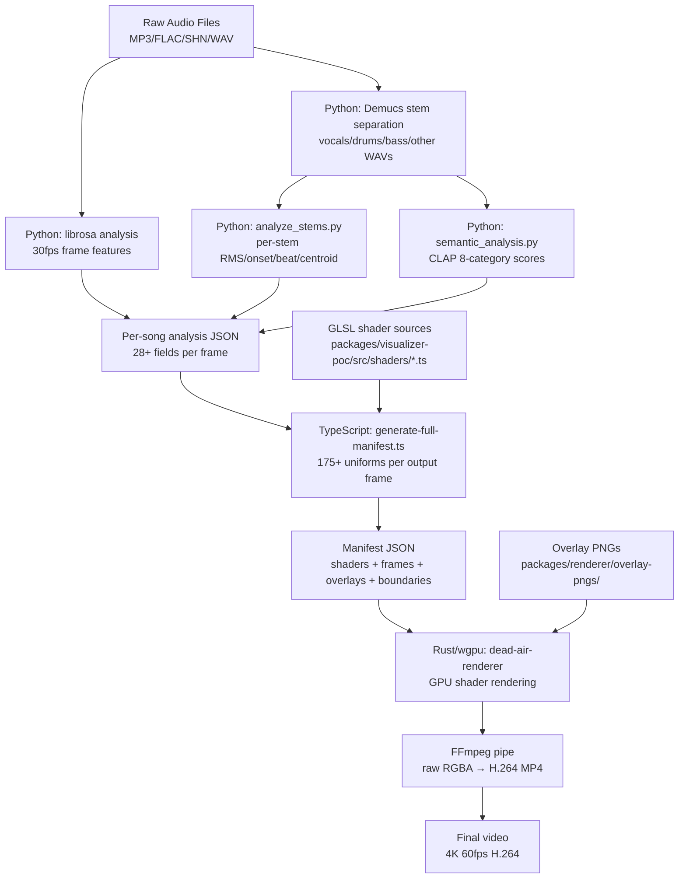
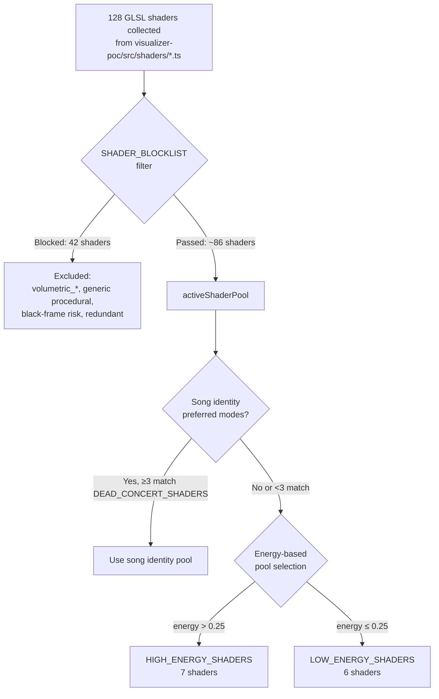
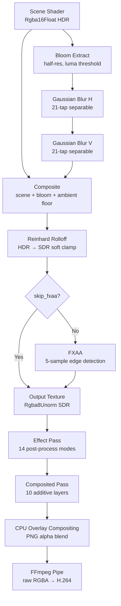

# Dead Air: Complete Architectural Reference

> For visual engineers joining the project. Document only — no code changes.
> Generated 2026-04-18 from full codebase analysis.

---

## Table of Contents

1. [Pipeline Topology](#1-pipeline-topology)
2. [Data Model](#2-data-model)
3. [Manifest Structure](#3-manifest-structure)
4. [Shader System](#4-shader-system)
5. [Overlay System](#5-overlay-system)
6. [Post-Processing Stack](#6-post-processing-stack)
7. [Gating / Trigger System](#7-gating--trigger-system)
8. [Transitions](#8-transitions)
9. [Text / Typography System](#9-text--typography-system)
10. [Render Orchestration](#10-render-orchestration)
11. [What's Changed Since Cornell](#11-whats-changed-since-cornell)
12. [Known Gaps and Fragility](#12-known-gaps-and-fragility)

---

## 1. Pipeline Topology

### End-to-End Flow



### What Runs Where

| Language | Stage | Cadence | Files |
|----------|-------|---------|-------|
| **Python** | Audio analysis (librosa) | Per-song | `packages/pipeline/scripts/analyze_audio.py` |
| **Python** | Stem separation (Demucs) | Per-song | `packages/pipeline/scripts/separate_stems.py` |
| **Python** | Stem analysis | Per-song | `packages/pipeline/scripts/analyze_stems.py` |
| **Python** | CLAP semantic analysis | Per-song | `packages/pipeline/scripts/semantic_analysis.py` |
| **TypeScript** | Pipeline orchestration | Per-show | `packages/pipeline/src/audio/orchestrator.ts` |
| **TypeScript** | Manifest generation | Per-show | `packages/renderer/generate-full-manifest.ts` |
| **Rust/wgpu** | GPU shader rendering | Per-frame | `packages/renderer/src/main.rs` |
| **Rust** | GLSL→WGSL transpilation (naga) | Per-shader | `packages/renderer/src/shader_cache.rs` |
| **Rust** | Overlay compositing | Per-frame | `packages/renderer/src/overlay_cache.rs` |
| **FFmpeg** | Video encoding | Per-frame (pipe) | `packages/renderer/src/ffmpeg.rs` |
| **Shell** | Render orchestration | Per-show | `packages/renderer/render-show.sh` |

### Boundary File Formats

| Boundary | Format | Typical Size |
|----------|--------|-------------|
| Raw audio → Python | WAV/FLAC/MP3 | 50-300 MB per song |
| Demucs → stem analysis | WAV (44.1kHz mono) | 4 × ~100 MB per song |
| Python → TS manifest gen | JSON (analysis) | 5-20 MB per song |
| TS → Rust renderer | JSON (manifest) | 500 MB – 1.6 GB for full show |
| Rust → FFmpeg | Raw RGBA pipe | 33 MB per frame (4K) |
| FFmpeg → disk | H.264 MP4 | 3-27 GB final |

---

## 2. Data Model

### 2a. Audio Analysis JSON (per song, 30fps)

**Location:** `{dataDir}/analysis/{date}/{trackId}-analysis.json`

**Metadata (`meta` object):**

| Field | Type | Description |
|-------|------|-------------|
| `source` | string | Audio file path |
| `duration` | float | Seconds |
| `fps` | int | 30 (analysis frame rate) |
| `sr` | int | 22050 (librosa sample rate) |
| `hopLength` | int | 735 (samples per frame = 22050/30) |
| `totalFrames` | int | Total analysis frames |
| `tempo` | float | BPM (global estimate) |
| `sections` | array | Section boundaries with energy labels |
| `stemsAvailable` | bool? | Whether Demucs stems exist |

**Per-frame fields (`frames[]`):**

Core audio (always present):

| Field | Type | Range | Source |
|-------|------|-------|--------|
| `rms` | float | 0-1 | RMS energy, normalized |
| `centroid` | float | 0-1 | Spectral centroid (brightness) |
| `onset` | float | 0-1 | Onset strength |
| `beat` | bool | — | Beat detected |
| `sub` | float | 0-1 | Sub-bass (0-100Hz) |
| `low` | float | 0-1 | Low (100-400Hz) |
| `mid` | float | 0-1 | Mid (400-2kHz) |
| `high` | float | 0-1 | High (2k-8kHz) |
| `chroma` | float[12] | 0-1 each | 12 pitch classes (C→B) |
| `contrast` | float[7] | varies | 7-band spectral contrast |
| `flatness` | float | 0-1 | 0=tonal, 1=noise |

Stem data (optional, from `analyze_stems.py`):

| Field | Type | Range | Source |
|-------|------|-------|--------|
| `stemBassRms` | float | 0-1 | Bass stem RMS |
| `stemDrumOnset` | float | 0-1 | Drum onset strength |
| `stemDrumBeat` | bool | — | Drum beat detected |
| `stemVocalRms` | float | 0-1 | Vocal stem RMS |
| `stemVocalPresence` | bool | — | Vocal RMS > 0.05 |
| `stemOtherRms` | float | 0-1 | Other stem RMS |
| `stemOtherCentroid` | float | 0-1 | Other stem brightness |

Harmonic (optional, from enhanced analysis):

| Field | Type | Range |
|-------|------|-------|
| `melodicPitch` | float | 0-1 (MIDI-normalized) |
| `melodicDirection` | float | -1 falling, 0 steady, +1 rising |
| `melodicConfidence` | float | 0-1 |
| `chordIndex` | int | 0-23 (12 major + 12 minor) |
| `chordConfidence` | float | 0-1 |
| `harmonicTension` | float | 0-1 (chord change rate over 2s) |

Deep audio (optional, from Level 2 analysis):

| Field | Type | Range |
|-------|------|-------|
| `tempoDerivative` | float | -1 to +1 |
| `dynamicRange` | float | 0-1 (peak/RMS ratio) |
| `spaceScore` | float | 0-1 (low energy + high flatness + no vocals) |
| `timbralBrightness` | float | 0-1 |
| `timbralFlux` | float | 0-1 |
| `vocalPitch` | float | 0-1 |
| `vocalPitchConfidence` | float | 0-1 |

CLAP semantic scores (optional, from `semantic_analysis.py`):

| Field | Type | Range |
|-------|------|-------|
| `semantic_psychedelic` | float | 0-1 |
| `semantic_aggressive` | float | 0-1 |
| `semantic_tender` | float | 0-1 |
| `semantic_cosmic` | float | 0-1 |
| `semantic_rhythmic` | float | 0-1 |
| `semantic_ambient` | float | 0-1 |
| `semantic_chaotic` | float | 0-1 |
| `semantic_triumphant` | float | 0-1 |

### 2b. Stem WAV Files

**Location:** `{dataDir}/stems/{date}/{trackId}/`

| File | Content | Format |
|------|---------|--------|
| `vocals.wav` | Isolated vocals | 44.1kHz mono WAV |
| `drums.wav` | Drums/percussion | 44.1kHz mono WAV |
| `bass.wav` | Bass guitar | 44.1kHz mono WAV |
| `other.wav` | Guitar/keys/strings | 44.1kHz mono WAV |

### 2c. Downstream Consumers

| Artifact | Read By |
|----------|---------|
| Analysis JSON | `generate-full-manifest.ts` (per-frame uniform computation) |
| Stem WAVs | `analyze_stems.py` (feature extraction only — not read at render time) |
| CLAP scores | `generate-full-manifest.ts` (semantic routing + GLSL uniforms) |
| Manifest JSON | `dead-air-renderer` (Rust GPU renderer) |
| Overlay PNGs | `overlay_cache.rs` (CPU compositing after GPU render) |
| GLSL sources | `generate-full-manifest.ts` (embedded in manifest as strings) |

---

## 3. Manifest Structure

### Top-Level Schema

**Location:** Output of `generate-full-manifest.ts`, consumed by `packages/renderer/src/manifest.rs`

```
{
  "shaders": { shader_id → GLSL fragment source string },
  "frames": [ FrameData, ... ],                           // one per output frame (60fps)
  "overlay_schedule": [ [ OverlayInstance, ... ], ... ],   // optional, per-frame
  "overlay_png_dir": "/path/to/overlay-pngs",             // optional
  "song_boundaries": [ SongBoundary, ... ],                // optional, for chapter cards
  "width": 3840,
  "height": 2160,
  "fps": 60
}
```

### FrameData Schema (175+ fields)

**Rust definition:** `packages/renderer/src/manifest.rs:54-244`

**Authored fields** (set explicitly in manifest generator logic):
- `shader_id`, `secondary_shader_id`, `blend_progress`, `blend_mode`
- `effect_mode`, `effect_intensity`, `composited_mode`, `composited_intensity`
- `camera_behavior`, `motion_blur_samples`
- `show_position`

**Derived fields** (computed from analysis data + show context):
- All audio uniforms (`energy`, `bass`, `mids`, etc.) — smoothed/dampened from raw analysis
- Structural state (`section_type`, `climax_phase`, `coherence`, `jam_density`, etc.)
- Envelope modulations (`envelope_brightness`, `envelope_saturation`, `envelope_hue`)
- Palette (`palette_primary`, `palette_secondary`, `palette_saturation`) — from song identity
- Era grading (`era_sepia`, `era_brightness`, `era_saturation`) — from show date/era
- Per-shader parameters (`param_motion_speed`, `param_bass_scale`, etc.)

**Default fields** (serde defaults in Rust if missing from JSON):
- `motion_blur_samples` → 1
- `effect_mode` → 0
- `effect_intensity` → 0.0
- `composited_mode` → 0
- `composited_intensity` → 0.0
- `show_position` → 0.0
- `camera_behavior` → 0
- All `Option<f32>` fields → `None`

### Audio Smoothing Windows

Before computing uniforms, raw 30fps analysis is smoothed with Gaussian windows:

| Field | Window (frames) | Duration | Purpose |
|-------|----------------|----------|---------|
| `energy` | 35 | ~3.5s | Primary energy metric |
| `slowEnergy` | 100 | ~10s | Macro arc |
| `bass` | 25 | ~2.5s | Low-end response |
| `mids` | 20 | ~2s | Mid-range |
| `highs` | 20 | ~2s | High-range |
| `fastEnergy` | 8 | ~0.8s | Responsive peaks |
| `fastBass` | 5 | ~0.5s | Snappy bass |

**Dampening factors** (applied on top of smoothing):

| Field | Factor | Effect |
|-------|--------|--------|
| `energy` | × 0.95 | 5% compression |
| `bass` | × 0.90 | 10% compression |
| `onset` | × 0.50 | 50% reduction |
| `beat` | × 0.80 | 20% reduction |
| `beat_snap` | × 0.60 | 40% reduction |

---

## 4. Shader System

### 4a. Pool Assembly

**File:** `packages/renderer/generate-full-manifest.ts:1209-1270`



**SHADER_BLOCKLIST** (42 shaders, `generate-full-manifest.ts:1209-1229`):
- C/D tier generics: `combustible_voronoi`, `creation`, `fluid_2d`, `digital_rain`, `seascape`, etc.
- Black-frame risk: `storm_vortex`, `mycelium_network`, `cosmic_voyage`, `solar_flare`
- Show-specific (song identity only): `morning_dew_fog`, `dark_star_void`, `fire_mountain_smoke`, etc.
- Redundant: `dual_blend`, `dual_shader`, `smoke_and_mirrors`, `molten_glass`, `particle_burst`

**DEAD_CONCERT_SHADERS** (9 shaders, `generate-full-manifest.ts:1260-1270`):
`tie_dye`, `fractal_flames`, `inferno`, `lava_flow`, `fractal_temple`, `kaleidoscope`, `stained_glass`, `sacred_geometry`, `smoke_rings`

These are warm, screen-filling, psychedelic — "like you're AT a Dead show, not watching a screensaver."

### 4b. Shader Selection (routeScene)

**File:** `packages/renderer/generate-full-manifest.ts:407-514`

6-priority decision tree:

| Priority | Condition | Result |
|----------|-----------|--------|
| 1 | IT transcendent forcing | **DISABLED** (false positive rate too high) |
| 2 | Drums/Space subphase active | Deterministic shader per subphase (e.g., `drums_peak` → `electric_arc`) |
| 3 | Reactive trigger fired | Pick from `reactiveState.shaderPool` via seeded RNG |
| 4 | Section crossfade (first 15% of section) | Blend `prevShader` → `currentShader` over max 3s |
| 5 | Dual-shader composition (climax or long high-energy section) | Blend primary + secondary from DUAL_POOLS |
| 6 | Default | Render current section's shader |

### 4c. Hold Enforcement

**File:** `packages/renderer/generate-full-manifest.ts:362-405`

Minimum hold durations (at 30fps baseline, scaled to output fps):

| Section Type | Hold Duration |
|-------------|---------------|
| `jam` | 3 minutes (5400 frames) |
| `space` | 5 minutes (9000 frames) |
| `solo` | 90 seconds (2700 frames) |
| `verse` / `chorus` / `bridge` | 30 seconds (900 frames) |
| `intro` / `outro` | 15 seconds (450 frames) |

Consecutive sections of the same type are grouped — hold starts from the first contiguous section.

### 4d. Parameter Binding (Audio → GLSL Uniforms)

**GLSL side:** `packages/visualizer-poc/src/shaders/shared/uniforms.glsl.ts` — 128 uniform declarations
**Rust side:** `packages/renderer/src/uniforms.rs` — 656-byte std140 buffer

Key uniform groups and their audio sources:

| Uniform Group | Source | Update Rate |
|--------------|--------|-------------|
| Time (`uTime`, `uDynamicTime`, `uBeatTime`) | Wall clock + tempo scaling | Per-frame |
| Core audio (`uBass`, `uEnergy`, `uOnset`, etc.) | Smoothed analysis frames | Per-frame, interpolated 30→60fps |
| Stem (`uStemBass`, `uVocalEnergy`, etc.) | `analyze_stems.py` output | Per-frame |
| Rhythm (`uBeatSnap`, `uMusicalTime`, `uTempo`) | Beat tracking | Per-frame |
| Structure (`uSectionType`, `uClimaxPhase`, etc.) | State machines in manifest gen | Per-frame (discrete) |
| Palette (`uPalettePrimary`, `uPaletteSaturation`) | Hand-curated per-song map | Per-song |
| Era (`uEraSepia`, `uEraBrightness`) | Show date → era lookup | Per-show |
| Camera (`uCamPos`, `uCamTarget`, `uCamFov`) | Computed in `uniforms.rs` from energy + section | Per-frame |
| Lighting (`uKeyLightDir`, `uKeyLightColor`, etc.) | EMA-smoothed section presets (α=0.03) | Per-frame |
| Envelope (`uEnvelopeBrightness`, etc.) | `sqrt(energy)` curve, 0.45–1.15 range | Per-frame |
| Semantic (`uSemanticPsychedelic`, etc.) | CLAP ML scores | Per-frame (interpolated) |
| Show identity (`uShowGrainCharacter`, etc.) | Seeded RNG from show date | Per-show |

### 4e. Palette Derivation

**Hand-curated song palettes** (`generate-full-manifest.ts:693-749`):

20 Dead songs have explicit `[primary_hue, secondary_hue, saturation]`:
- `"Dark Star"` → `[260, 290, 0.75]` (deep indigo / violet)
- `"Sugar Magnolia"` → `[45, 30, 0.95]` (golden sunshine)
- `"China Cat Sunflower"` → `[40, 25, 0.95]` (warm amber)
- `"He's Gone"` → `[250, 220, 0.65]` (twilight blue)
- etc.

**Application in GLSL** (`postprocess.glsl.ts:372-401`):
- Luminance-aware hue rotation: dark/desaturated pixels minimally rotated, bright saturated pixels strongly rotated toward palette hue
- Strength: 50-90% adaptive (based on hue distance)
- Saturation gate: only rotate pixels with existing color (`hsv.y > 0.08`)

**Era grading presets:**

| Era | Dates | Sepia | Brightness | Saturation | Warmth |
|-----|-------|-------|-----------|-----------|--------|
| `primal` | 1965-1974 | 0.15 | 1.08 | 1.20 | 0.30 |
| `classic` | 1975-1979 | 0.06 | 1.02 | 1.10 | 0.12 |
| `hiatus` | 1980-1986 | 0.02 | 0.98 | 0.95 | -0.05 |
| `touch_of_grey` | 1987-1990 | 0.00 | 1.00 | 1.00 | 0.00 |
| `revival` | 1991-1995 | 0.01 | 0.99 | 0.98 | -0.02 |

---

## 5. Overlay System

### 5a. Pool Composition

**Registry:** `packages/visualizer-poc/src/data/overlay-registry.ts` (356 entries total)

| Tier | Count | Description |
|------|-------|-------------|
| A-tier | 30 | Iconic Dead overlays — always in active pool |
| B-tier | 45 | Solid rotation overlays |
| C-tier (archived) | 281 | Culled April 2026 — below quality bar |
| **Active total** | **75** | After cull |
| Always-active | 3 | SongTitle, FilmGrain, SmokeWisps |

**Overlay layers:**
- Layer 1: Atmospheric (wisps, fog)
- Layer 2: Sacred (stealies, geometry, mandalas)
- Layer 5: Nature (cosmic, celestial, organic)
- Layer 6: Character (band members, bears)
- Layer 7: Artifact (song titles)
- Layer 10: Distortion (film grain)

### 5b. Selection Logic

**File:** `packages/visualizer-poc/src/data/overlay-rotation.ts` (737 lines)

**Per-window overlay count** (energy-driven, INVERTED at peaks):

| Energy Band | Overlay Count | Rationale |
|------------|--------------|-----------|
| Low | 4-5 | Rich atmospheric depth during quiet |
| Mid | 3-4 | Moderate support |
| High | 1-2 | Clean — shader owns the moment |
| Peak texture | Count - 1 | Further reduction at peaks |
| Pre-peak dropout | 0 | Total withdrawal before climax |

**Density modifiers stack multiplicatively:**
- Song identity `overlayDensity` multiplier
- Show arc `densityMult` (builds through show)
- Drums/Space phase caps
- Stem section type: `vocal` → -1, `solo` → cap 1, `quiet` → -2, `jam` → +1

**Scoring** (`overlay-scoring.ts`):
- A-tier baseline: +0.25
- B-tier baseline: +0.10
- Gaussian energy matching (overlay's energyBand center vs. window avgEnergy)
- Low duty cycle preferred (more variety)
- Dead-culture tag boost at high energy
- Penalize repetition from previous window

### 5c. Compositing Order and Blend Modes

**File:** `packages/renderer/src/overlay_cache.rs` (331 lines)

**Compositing happens on CPU** after GPU render, before FFmpeg encode.

Order: overlays composited in z-order (layer number), lowest first.

**Blend modes:**

| Mode | Formula | Usage |
|------|---------|-------|
| Screen | `1 - (1-dst)(1-src)` | Default for all overlays — luminous, non-destructive |
| Normal | `src` (alpha-weighted) | Rare, for opaque overlays |
| Multiply | `dst × src` | Rare, for darkening effects |

**Dark pixel skip:** Luma < 0.12 → pixel skipped entirely (prevents dark PNG backgrounds from compositing)

**Opacity caps:**
- Hero overlays: max 0.30
- Accent overlays: max 0.40
- Ambient overlays: max 0.25
- FilmGrain: 0.15

### 5d. Audio-Reactive Transforms

Per-frame overlay transforms include:

| Transform | Source | Range |
|-----------|--------|-------|
| `offset_x` | Sinusoidal drift + bass breathing | ±0.12 from center |
| `offset_y` | Cosine drift | ±0.10 |
| `scale` | 1.0 + sin(time) × 0.1 + energy × 0.3 | 0.7 – 1.3 |
| `rotation_deg` | Time-based + beat-synced | 0-360° |
| `opacity` | Energy response curve + accent flash on onset + silence breathing withdrawal | 0-1 |

**Silence breathing:** If RMS < 0.03 for >50% of a 3-second window, overlays progressively withdraw to 40% of base opacity.

---

## 6. Post-Processing Stack

### 6a. Ordered Pipeline



### 6b. Gamma Chain

| Stage | Color Space | Format |
|-------|------------|--------|
| Scene shader output | Display-referred sRGB (ACES tone map in GLSL) | Rgba16Float |
| Bloom extract/blur | Linear RGB (HDR) | Rgba16Float |
| Composite + Reinhard | sRGB → SDR clamped | Rgba16Float → Rgba8Unorm |
| FXAA | sRGB SDR | Rgba8Unorm |
| Effect/Composited pass | sRGB SDR | Rgba8Unorm |
| FFmpeg encode | sRGB with BT.709 colorspace flags | yuv420p |

**No explicit gamma encode/decode in the Rust pipeline.** GLSL ACES already outputs sRGB. Rust passes through to SDR via soft Reinhard rolloff only.

### 6c. Bloom Parameters

| Parameter | Value | Notes |
|-----------|-------|-------|
| Tap count | 21 | Separable Gaussian (H + V) |
| Resolution | Half (1920×1080 for 4K) | 4× fewer fragment invocations |
| Threshold | `mix(0.58, 0.18, energy)` | Energy-reactive: more bloom at peaks |
| Threshold offset | `-0.08 - energy × 0.18` | Additional lowering |
| Blend | 5% screen | `col + bloom × (1 - col)` |
| Ambient floor | 0.02 dark + 0.04 palette-derived | Warm purple base |

### 6d. Dynamic Range Targets

**Envelope brightness:** `0.45 + sqrt(smoothstep(energy)) × 0.70`
- Quiet (energy=0): 0.45
- Loud (energy=1): 1.15

**Envelope saturation:** `0.80 + factor × 0.60`
- Quiet: 0.80
- Loud: 1.40

**Film grain:** `mix(0.02, 0.07, energy)` with 2-frame hold animation

### 6e. GLSL Post-Process Chain (8 stages)

**File:** `packages/visualizer-poc/src/shaders/shared/postprocess.glsl.ts`

1. **Beat pulse** — 0.012 amplitude brightness swell on confident beats
2. **Lens distortion** — barrel warp, `0.02 + energy × 0.06`
3. **Bloom** — energy-reactive threshold, screen blend
4. **Chromatic aberration** — radial, energy-gated, max 0.03
5. **Halation** — warm film glow around bright areas
6. **Light leak** — drifting warm amber glow at 0.7× opacity
7. **Cinematic grade** — ACES filmic tone mapping
8. **Film grain** — resolution-aware, era-modulated

Additional modulations applied after the 8-stage chain:
- Quiet-passage micro-detail (sparkle dust, nebular wisps, deeper vignette)
- Semantic CLAP modulation (psychedelic → saturated; tender → desaturated)
- Era grading (sepia, warmth, contrast per era)
- Song palette hue rotation
- Show warmth (split-tone: golden highlights, amber shadows)
- Entrainment oscillation (14-20s slow brightness breathing, below conscious perception)
- Dramatic vignette (35% opacity)
- Blacks crush

### 6f. Where the 24 Effects Slot In

**14 Post-Process Effects** (`packages/renderer/src/effects.rs`):
Run AFTER postprocess, transform the SDR output texture.

| Mode | Effect | Category |
|------|--------|----------|
| 1 | Kaleidoscope | UV distortion |
| 2 | Deep Feedback | Recursive temporal |
| 3 | Hypersaturation | Color boost |
| 4 | Chromatic Split | Lens prismatic |
| 5 | Trails/Echo | Persistence |
| 6 | Mirror Symmetry | UV reflection |
| 7 | Audio Displacement | Frequency-mapped warp |
| 8 | Zoom Punch | Beat-reactive zoom |
| 9 | Breath Pulse | Organic scale oscillation |
| 10 | Light Leak Burst | Film leak glow |
| 11 | Time Dilation | Temporal slow-motion |
| 12 | Moire Patterns | Interference overlay |
| 13 | Depth of Field | Poisson disk bokeh |
| 14 | Glitch/Datamosh | Digital corruption |

**10 Composited Effects** (`packages/renderer/src/composited_effects.rs`):
Run AFTER effects, generate new visual layers with additive blending onto the output texture.

| Mode | Effect | Category |
|------|--------|----------|
| 1 | Particle Swarm | 12 floating orbs |
| 2 | Caustics | Voronoi water refraction |
| 3 | Celestial Map | 3-layer star field |
| 4 | Tunnel/Wormhole | Concentric rings |
| 5 | Fire/Embers | 10 rising embers |
| 6 | Ripple Waves | Concentric ring lines |
| 7 | Strobe/Flicker | Broadcast-safe beat flash |
| 8 | Geometric Breakdown | Voronoi crystal fracture |
| 9 | Liquid Metal | Chrome/mercury surface |
| 10 | Concert Poster | CMYK halftone dots |

---

## 7. Gating / Trigger System

### 7a. Post-Process Effect Triggers

**File:** `packages/renderer/generate-full-manifest.ts:1491-1590`

**Hold/cooldown parameters:**

| Parameter | Value |
|-----------|-------|
| MIN_HOLD | 3 seconds (`fps × 3`) |
| MAX_HOLD | 8 seconds (`fps × 8`) |
| COOLDOWN | 5 seconds (`fps × 5`) |
| Fade-in | 15 frames (~0.5s at 30fps) |
| Fade-out | 15 frames |

**Trigger priority cascade:**

| Priority | Signal | Threshold | Effect Pool | Intensity |
|----------|--------|-----------|------------|-----------|
| 1 | Climax/sustain | `phase === "climax"` or `sustain && intensity > 0.6` | Hypersaturation, Chromatic, Kaleidoscope, Light Leak | `peak × 0.65` |
| 2 | Strong build | `phase === "build" && intensity > 0.7` | Breath Pulse, Deep Feedback, Moire | `build × 0.40` |
| 3 | High-energy beat | `energy > 0.50 && beatSnap > 0.5` | Zoom Punch, Chromatic, Glitch, Audio Displace | `energy × 0.50` |
| 4 | Jam section | `sectionType ∈ [4.5, 5.5) && energy > 0.35` | Feedback, Trails, Kaleidoscope, Mirror, Audio Displace | `0.35 + energy × 0.25` |
| 5 | Deep space | `spaceScore > 0.6` | Time Dilation, DoF, Breath | `0.30 + spaceScore × 0.20` |
| 6 | Song finale | `songProgress > 0.88 && energy > 0.40` | Light Leak, Hypersaturation, Trails | `energy × 0.45` |

Priorities 3-6 have probability gates (10-15% chance per qualifying frame) to avoid constant triggering.

**Effect selection within a pool:** `seededRandom(songIdx × prime + floor(frameIdx / MIN_HOLD))` — deterministic per-hold-window, varies across songs.

### 7b. Composited Effect Triggers

**File:** `packages/renderer/generate-full-manifest.ts:1610-1685`

**Independent state machine** (can fire simultaneously with post-process effects):

| Parameter | Value |
|-----------|-------|
| COMP_MIN_HOLD | 4 seconds |
| COMP_MAX_HOLD | 10 seconds |
| COMP_COOLDOWN | 8 seconds |
| Fade-in/out | 20 frames |

| Signal | Threshold | Effect Pool | Intensity |
|--------|-----------|------------|-----------|
| Deep space | `sectionType ≥ 6.5 && energy < 0.15` | Celestial Map, Liquid Metal | `0.50 + spaceScore × 0.20` |
| Jam section | `sectionType ∈ [4.5, 5.5) && energy > 0.35` | Particles, Caustics, Fire, Geometric | `0.40 + energy × 0.30` |
| Climax/sustain | As above | Tunnel, Fire, Strobe | `0.55 + energy × 0.25` |
| High-energy beat | `energy > 0.45 && beatSnap > 0.4` | Ripples, Strobe, Geometric | `0.45 + energy × 0.25` |
| Song finale | `songProgress > 0.90 && energy > 0.30` | Concert Poster, Tunnel | `0.50` |

### 7c. Coverage Statistics (Veneta show)

| Metric | Value |
|--------|-------|
| Post-process effect frames | 23.1% |
| Composited effect frames | 13.5% |
| Both active simultaneously | 4.7% |
| Total frames with any effect | ~32% |
| No sacred-moment authoring exists | All triggers are algorithmic |

### 7d. Precedence Rules

- Post-process and composited are **fully independent** — both can fire simultaneously
- Within each system, the **first matching priority wins** (cascade, not stack)
- Hold system prevents mode changes mid-hold regardless of new trigger priority
- Cooldown prevents any trigger for 5-8 seconds after a hold expires
- No manual authoring or override system exists — triggers are purely algorithmic

---

## 8. Transitions

### 8a. Song-to-Song Transitions

Not currently handled as a special case. The last frame of song N and first frame of song N+1 may have different shaders, creating a hard cut unless a section crossfade (Priority 4) spans the boundary. In practice, chapter cards (3-second interstitials) serve as transitions between songs.

### 8b. Intra-Song Shader Changes

**File:** `packages/renderer/src/transition.rs` (363 lines)

When `secondary_shader_id` and `blend_progress` are set:

1. Primary shader renders to HDR texture A
2. Secondary shader renders to HDR texture B
3. GPU transition shader blends A + B using one of 4 blend modes:

| Blend Mode | Algorithm |
|-----------|-----------|
| `dissolve` | `mix(from, to, progress)` — linear crossfade |
| `additive` | `min(from + to × progress, 1.5)` — both contribute light |
| `luminance_key` | Bright areas of incoming punch through first |
| `noise_dissolve` | `hash21()` noise-based organic edge |

**Crossfade timing** (`generate-full-manifest.ts:483-490`):
- Duration: min(3 seconds, 15% of section length)
- Blend mode: selected based on energy — high energy → `additive` or `luminance_key`, low → `dissolve`

**Hold enforcement** prevents shader changes during minimum hold windows (see §4c).

**Temporal blend** is disabled during transitions to prevent ghosting (`main.rs:648`).

### 8c. Dual-Shader Composition

When climax forces dual composition or a long high-energy section qualifies:
- `blend_progress` = `0.10 + energy × 0.30 + sin(sectionProgress × π) × 0.12 + beatPulse`
- Cap: set 1 = 0.35, other sets = 0.55
- Secondary shader chosen from `DUAL_POOLS` map (complementary aesthetic pairs)

---

## 9. Text / Typography System

### 9a. Intro (15 seconds)

**File:** `packages/renderer/src/intro.rs` (1006 lines)

| Phase | Time | Content |
|-------|------|---------|
| 0-5s | Emergence | Black → amber point blooms, liquid light shader |
| 5-7.5s | Logo fade-in | "DEAD AIR" hand-crafted SVG letterforms emerge |
| 7.5-8s | Logo full | Art Nouveau + psychedelic organic curves |
| 8-10s | Logo fade-out | Dissolve |
| 10.5-12.5s | Show card fade-in | Venue (large), City (medium), Date (small) |
| 12.5-13.5s | Show card full | Georgia serif italic, cream with drop-shadow |
| 13.5-14.5s | Show card fade-out | Dissolve to first song |

Shader: `__intro_emergence__` — liquid light projector (oil on glass simulation, domain-warped noise).

Synthetic audio ramp: energy builds 0→0.3, bass phase modulated.

CLI flags: `--with-intro`, `--show-venue`, `--show-city`, `--show-date`, `--brand-image`

### 9b. Song Titles (NowPlaying)

Part of overlay schedule. Rendered as SVG text overlay.

| Phase | Time |
|-------|------|
| Fade in | 0-1s after song start |
| Hold | 1-9s |
| Fade out | 9-11s |

### 9c. Chapter Cards (3 seconds each)

**File:** `packages/renderer/src/chapter_card.rs` (342 lines)

Inserted between songs when `--with-chapter-cards` is set.

| Phase | Time |
|-------|------|
| Fade in | 0-0.5s |
| Hold | 0.5-2.5s |
| Fade out | 2.5-3.0s |

Content: "GRATEFUL DEAD" (small), decorative line, Song Title (large), Set/Track (small).

Shader: endcard fog shader.

### 9d. End Card (10 seconds)

**File:** `packages/renderer/src/endcard.rs` (331 lines)

| Phase | Time |
|-------|------|
| Fade out | 0-2s (last shader dissolves) |
| Setlist | 2-7s (show setlist with "DEAD AIR" logo) |
| Final fade | 7-10s (to black) |

Shader: `__endcard__` — deep indigo fog with dying embers.

CLI flags: `--with-endcard`, `--song-titles`

### 9e. Typography

All text uses hand-crafted SVG path letterforms — **not system fonts**. Art Nouveau meets psychedelic organic curves. Cream fill with depth shadow and amber glow halo.

---

## 10. Render Orchestration

### 10a. Three-Pass Pipeline (render-show.sh)

**File:** `packages/renderer/render-show.sh` (255 lines)

```
Pass 1: npx tsx generate-full-manifest.ts → manifest.json
Pass 2: dead-air-renderer --manifest manifest.json → shaders.mp4
Pass 3: ffmpeg composite + audio mux → final.mp4
```

### 10b. Rust Renderer Execution

**File:** `packages/renderer/src/main.rs`

**Pipelined rendering:**
- While GPU renders frame N, CPU processes frame N-1's pixels (overlay compositing + FFmpeg write)
- Double-buffered readback eliminates synchronous GPU stalls

**Three render paths per frame:**

| Path | Condition | Steps |
|------|-----------|-------|
| Transition | `secondary_shader_id` present | Render primary → HDR A, render secondary → HDR B, GPU blend, postprocess |
| Motion blur | `motion_blur_samples > 1` | Render N sub-frames at offset times, accumulate, postprocess |
| Standard | Default | Render single shader → HDR, postprocess |

After any path: effect pass → composited pass → readback → CPU overlay composite → FFmpeg pipe.

**FFmpeg configuration:**
```
-f rawvideo -pix_fmt rgba -s 3840x2160 -r 60 -i pipe:0
-c:v libx264 -preset medium -crf 18 -pix_fmt yuv420p
-color_range pc -colorspace bt709 -color_trc iec61966-2-1
-movflags +faststart
```

256 MB `BufWriter` on stdin pipe prevents deadlocks.

### 10c. Cloud GPU Path (Vast.ai)

**Files:** `packages/renderer/vast-render.sh`, `scripts/cloud-bootstrap-vast.sh`

1. Upload manifest + overlay PNGs + renderer source to S3
2. Spin up Vast.ai instances (GPU, typically A100/A6000)
3. Each instance renders a frame range (`--start-frame N --end-frame M`)
4. Upload chunk MP4s back to S3
5. Concatenate chunks with `concat-show.sh`

### 10d. FXAA Skip List

Shaders with fine geometric detail skip FXAA (preserves procedural edges):

`fractal_temple`, `mandala_engine`, `sacred_geometry`, `kaleidoscope`, `truchet_tiling`, `diffraction_rings`, `stained_glass`, `neural_web`, `voronoi_flow`, `fractal_flames`, `fractal_zoom`, `reaction_diffusion`, `morphogenesis`, `feedback_recursion`, `crystalline_growth`

---

## 11. What's Changed Since Cornell

### Ordered list of substantive changes

| # | Change | Problem Solved | Risk Introduced |
|---|--------|----------------|----------------|
| 1 | **60fps output** (was 30fps) | "not smooth" viewer feedback | 2× GPU load; analysis still 30fps (interpolated) |
| 2 | **Audio dampening** — 35-frame energy smoothing, 50% onset reduction, 60% beat_snap reduction | "seizure inducing" visual speed | Possible over-dampening; quiet passages may feel sluggish |
| 3 | **Song-specific color palettes** — 20 hand-curated hue maps, luminance-aware rotation in GLSL | "doesn't feel like the Dead" / washed generic look | Songs without palette entry get no rotation |
| 4 | **Era grading** — sepia, warmth, brightness per era | All shows looked the same | Primal era (1972) may be too warm/sepia for some tastes |
| 5 | **Split-tone warmth** — golden highlights, amber shadows | Cold/clinical feel | May fight with palette rotation on cool-palette songs |
| 6 | **GPU-native transitions** — DualShaderQuad blend on GPU | CPU blend was bottleneck | Transition code in visualizer-poc NOT wired (only Rust path works) |
| 7 | **Shader blocklist** — 42 shaders excluded from pool | Black frames, screensaver quality | Song identity preferred modes silently ignored if blocked |
| 8 | **DEAD_CONCERT_SHADERS filter** — 9 warm screen-filling shaders | Sparse raymarchers produce mostly black | Visual variety reduced to 9 shaders in practice |
| 9 | **14 post-process effects** — kaleidoscope through glitch | Visual monotony | Time dilation was BROKEN (nearly black), fixed; breath pulse very subtle |
| 10 | **10 composited effects** — particles through concert poster | Shader-only plateau | Required additive blending to be visible; poster effect weakened by additive mode |
| 11 | **Effect hold/cooldown system** — 3-8s hold, 5s cooldown | Per-frame effect flickering | Average run ~16s may be too long for some effects |
| 12 | **Overlay cull** — 356 → 75 active overlays | Programmer art quality | Reduced variety |
| 13 | **Overlay density inversion** — fewer overlays at peaks, more at quiet | Over-busy at climax | Quiet passages may feel cluttered |
| 14 | **Dark pixel skip** — luma < 0.12 threshold | Overlay PNGs had opaque dark backgrounds appearing as stickers | May skip legitimate dark overlay content |
| 15 | **Hand-crafted SVG letterforms** — Art Nouveau "DEAD AIR" logo | System font typography "falls flat" | SVG paths are hand-coded, hard to modify |
| 16 | **Intro/endcard/chapter cards** | No narrative framing | Adds 15s + 10s + (N × 3s) to show length |
| 17 | **Dead air trim** — 80% sustained energy over 5s window | 4 minutes of tuning/chatter between songs | Single loud moment (mic pop) can trick the detector |
| 18 | **Entrainment oscillation** — 14-20s brightness breathing | Viewer fatigue over 3 hours | Below conscious perception — may not be noticeable |
| 19 | **Camera system** — orbital + section-type behaviors | Static framing | User skeptical of camera motion (past attempts were "shaky/bad") |
| 20 | **Composited effect triggers** — algorithmic, no manual authoring | Effects never fired (Veneta had 0% coverage before fix) | No way to manually mark sacred moments |

---

## 12. Known Gaps and Fragility

### 12a. Unimplemented Features Still in Code

| Feature | Status | Location |
|---------|--------|----------|
| **Dual-shader composition (TS side)** | Code exists, explicitly disabled | `SceneRouter.tsx:410` — TODO: "not yet wired" |
| **Lyric overlay system** | Components exist, not mounted | `LyricTriggerLayer.tsx`, `PoeticLyrics.tsx` |
| **Volumetric shaders** | GLSL exists, blocked from pool | `volumetric-smoke.ts`, `volumetric-clouds.ts`, `volumetric-nebula.ts` |
| **Temporal blend post-pass** | GLSL exists, not wired | `temporal-blend.glsl.ts:14` — "Not yet wired in" |
| **DOF post-pass (GLSL side)** | GLSL exists, not wired | `dof-postpass.glsl.ts:9` — "Not yet wired in" |
| **Anaglyph / CRT modes** | No implementation found | — |

### 12b. Silent Fallbacks

| Location | Condition | Fallback | Risk |
|----------|-----------|----------|------|
| `generate-full-manifest.ts:1158-1161` | 9 analysis functions throw | Neutral defaults (idle, no trigger, no coherence) | Core audio reactivity silently disabled; no logging |
| `generate-full-manifest.ts:1121` | Coherence computation throws | All frames `{isLocked: false, score: 0}` | IT response + groove locking silently disabled |
| `generate-full-manifest.ts:1301` | Energy pool selection returns empty | Hardcoded `["fractal_temple", "aurora", "deep_ocean", "inferno", "stained_glass"]` | May include blocked shaders |
| `generate-full-manifest.ts:1276-1280` | Song identity preferred modes all blocked | Falls through to energy pool | Song visual intent silently lost |
| `main.rs:590-603` | Shader fails naga compile | **Black frame written** + `continue` | Video has random black frames; only discovered at render time |
| `main.rs:449-456` | Overlay PNG directory doesn't exist | Skips all overlay loading | Entire overlay system silently disabled |
| `manifest.rs:217` | `motion_blur_samples` missing from JSON | Defaults to 1 (no blur) | Intended blur silently disabled |
| `manifest.rs:38` | `song_boundaries` missing | No chapter cards inserted | |

### 12c. Static/Dynamic Type Disagreement

| Issue | Location | Impact |
|-------|----------|--------|
| TS generates `climax_phase` as string ("idle"/"build"/etc.), Rust reads it as integer (0-4) | `manifest.rs:207` vs `generate-full-manifest.ts:607` | Mapping exists at line 607; correct but fragile |
| `contrast` field is `Option<Vec<f32>>` in Rust but always emitted as 7-element array in TS | `manifest.rs:211` | Works but no validation of array length |
| No validation that all `shader_id` values exist in `manifest.shaders` map | Post-generation | Silent black frames if shader missing |
| No validation that `secondary_shader_id` values exist | Post-generation | Silent black frames during transition |
| GLSL declares 128 uniforms; Rust packs 656-byte buffer | `uniforms.glsl.ts` vs `uniforms.rs` | Offset mismatch would silently corrupt all uniforms |

### 12d. Architectural Fragility

| Issue | Severity | Detail |
|-------|----------|--------|
| **Single file orchestrates everything** | HIGH | `generate-full-manifest.ts` (2000+ lines) handles shader collection, all 175+ uniform computations, routing, overlay scheduling, and manifest writing. Any utility failure cascades. |
| **Shader compilation at render time, not manifest time** | MEDIUM | A bad shader string passes through manifest generation unchecked; only fails when renderer tries to compile it, potentially hours later. |
| **Full manifest in memory** | MEDIUM | 648K frames × 175 fields = ~456 MB JSON. Large shows risk OOM. No msgpack output from TS side (Rust can read it but TS doesn't write it). |
| **Directory structure assumptions** | HIGH | Manifest generator assumes `../visualizer-poc` exists relative to `__dirname`. Broken symlink = empty shader map = all-black video. No validation. |
| **Parallel generation race condition** | MEDIUM | `generate-manifest-parallel.ts` uses temp directory without locking. Concurrent runs on same data-dir collide. |
| **Error swallowing** | CRITICAL | 9 `try/catch {}` blocks in manifest gen with no logging. Process exits 0 even if 50% of frames have failed analysis. Renderer starts with partially-broken manifest. |
| **No pre-flight validation** | HIGH | No check that manifest.shaders contains all referenced shader_ids. No check that overlay PNGs exist. No check that analysis data covers all frames. All discovered at render time. |
